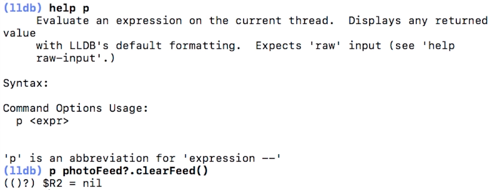

# *iOS Debugging Notes*

## *1.Symbolic breakpoints*

### Symbolic breakpoint - Hit breakpoint on any UIViewController deallocation

`-[UIViewController dealloc]`
  
`po $arg1`
#### EXAMPLE: 

  

When Symbolic breakpoint hits, we can use example arguments:
- Symbolic fetch Objective C
`po (BOOL)[$arg1 isKindOfClass:[UIViewController class]].` 
- Symbolic fetch Swift
`po (BOOL)[$arg1 isKindOfClass:(id)NSClassFromString(@"ModuleOrAppName.SomeViewController")]`

- Symbolic breakpoint CONTITION for Swift: `(BOOL)[$arg1 isKindOfClass:(id)NSClassFromString(@"ModuleOrAppName.SomeViewController")]`
#### EXAMPLE: 

## *2.LLDB*

### `po` - evaluate expressions
  

### `p` - evaluate expressions and methods
  

### `fr v` - don't do expressions, only inspecting data, and it's safe but more limited
  

## *Creating Global Session Variables:* 

  

### We even can create global variables with breakpoints: 
in example:
- we create `p var $row = 0` in viewDidLoad 
- change this var in tableViewDidSelect `p $row == indexPath.row` 
- and stop when `$row == 2`

## *Changing UI with LLDB* 
- assign new text to label `p label.text = "changed label text"`
- and refresh UI `p CATransaction.flush()`

  

## *LLDB Step commands* 

  

## *LLDB View Return Values* 

When we have breakpoint in return value like this:
  

  

- we can hit `finish` and it will step out of this method and execute return
- then we get memory address of returned value by `register read $rax` (swift)
- then we can extract what is stored in that location if we know the type by `po unsafeBitCast(0x0000600001acf1e0, to: UIImage.self)`
- and we can creat expression and view the image extracted from memory

  

